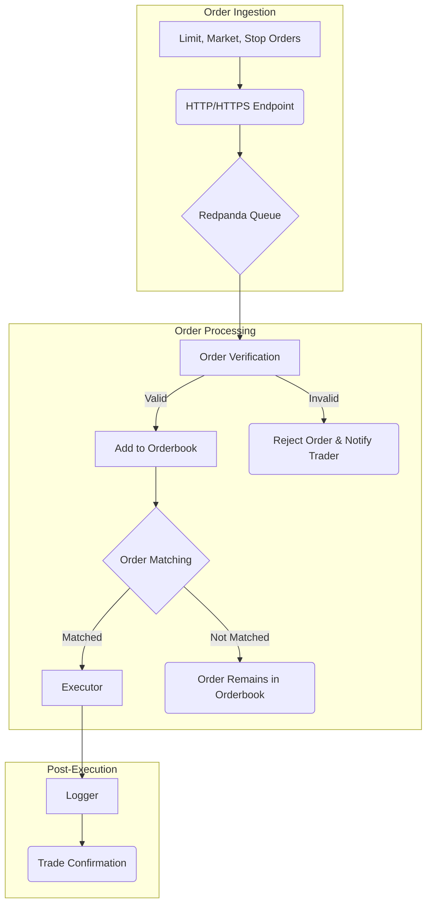

# Live Trading Engine

## Architecture



## Building the Project

### Prerequisites
- CMake 3.20+
- C++23 compatible compiler:
  - GCC 12+ (full C++23 support)
  - Clang 15+ (partial C++23 support, 17+ recommended)
  - MSVC 19.35+ (Visual Studio 2022 17.5+)
- clang-format 15+ (for C++23 formatting)
- clang-tidy 15+ (for C++23 static analysis)

### Quick Start
```bash
# Build the project
./scripts/build.sh

# Run the trading engine
./build/apps/trading_engine/live_trading_engine

# Run tests
./scripts/run_tests.sh
```

## Code Quality & Style

This project enforces consistent code style and quality through automated tools.

### Code Formatting
The project uses **clang-format** with a custom configuration based on Google style:

```bash
# Format all C++ files
./scripts/format.sh

# Check if files need formatting (CI mode)
./scripts/format.sh --check

# Preview formatting changes without modifying files
./scripts/format.sh --dry-run

# Verbose output
./scripts/format.sh --verbose
```

**CMake Targets:**
```bash
make format        # Format all source files
make format-check  # Check formatting without changes
```

### Static Analysis
The project uses **clang-tidy** for static code analysis:

```bash
# Run static analysis
./scripts/lint.sh

# Run analysis with auto-fix
./scripts/lint.sh --fix

# Use multiple parallel jobs
./scripts/lint.sh --jobs 8

# Verbose output
./scripts/lint.sh --verbose
```

**CMake Targets:**
```bash
make lint          # Run static analysis
make lint-fix      # Run analysis with auto-fix
make quality       # Run both formatting check and linting
```

### Pre-commit Hooks
Set up automatic code quality checks before each commit:

```bash
# Install the pre-commit hook
ln -s ../../scripts/pre-commit.sh .git/hooks/pre-commit

# The hook will automatically run:
# 1. Code formatting check
# 2. Static analysis on staged files
# 3. Build verification
# 4. Common issue detection (TODOs, debug prints)
```

### Style Guide Summary
- **Indentation:** 4 spaces, no tabs
- **Line Length:** 100 characters
- **Braces:** Attached style (`{` on same line)
- **Naming:**
  - Classes/Structs: `CamelCase`
  - Functions: `camelBack`
  - Variables: `lower_case`
  - Private members: `lower_case_` (trailing underscore)
  - Constants: `UPPER_CASE`
- **Includes:** Sorted with project headers first
- **Namespace Usage:** 
  - Never use `using namespace std`
  - Always use explicit `std::` prefixes
  - Never add custom code to `std` namespace
  - Template specializations for std types go at global scope

### Configuration Files
- **`.clang-format`** - Code formatting rules (C++23 compatible)
- **`.clang-tidy`** - Static analysis configuration with C++23 checks
- Both files are tuned for financial software requirements