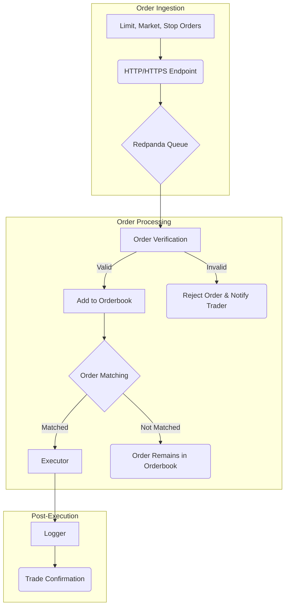

# Live Trading Engine

## Architecture

```mermaid
graph TD
    subgraph Order Ingestion
        A[Limit, Market, Stop Orders] --> B(HTTP/HTTPS Endpoint)
        B --> C{Redpanda Queue}
    end

    subgraph Order Processing
        C --> D[Order Verification]
        D -- Valid --> E[Add to Orderbook]
        D -- Invalid --> F(Reject Order & Notify Trader)
        E --> G{Order Matching}
        G -- Matched --> H[Executor]
        G -- Not Matched --> I(Order Remains in Orderbook)
    end

    subgraph Post-Execution
        H --> J[Logger]
        J --> K(Trade Confirmation)
    end
```