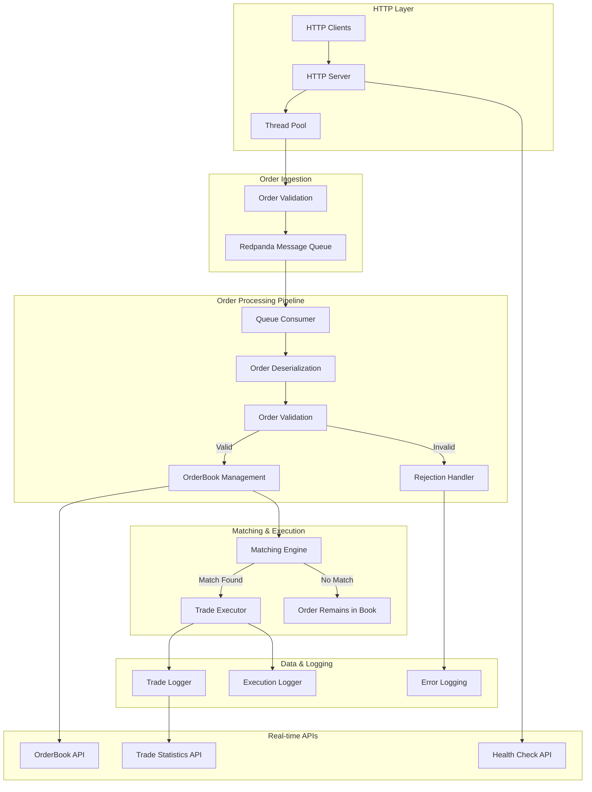

# Live Trading Engine

[](https://github.com/ACquantclub/live-trading-engine/actions/workflows/ci.yml)
[](https://opensource.org/licenses/MIT)

A high-performance, low-latency trading engine built in C++23 with asynchronous order processing, real-time matching, and HTTP API endpoints.

## Architecture



## Quick Start

### Prerequisites
- C++23 compatible compiler (GCC 12+ or Clang 15+)
- CMake 3.20+
- Redpanda or Kafka (for message queue)

### Build and Run
```bash
# Clone the repository
git clone https://github.com/ACquantclub/live-trading-engine.git
cd live-trading-engine

# Build the project
./scripts/build.sh

# Start the trading engine
./build/apps/trading_engine/trading_engine

# Run tests
./scripts/run_tests.sh
```

### Configuration
The engine uses `config/trading_engine.json` for configuration:

```json
{
  "http": {
    "host": "0.0.0.0",
    "port": 8080,
    "threads": 4
  },
  "redpanda": {
    "brokers": "<redpanda-host>:9092"
  }
}
```

## HTTP API Reference

The trading engine exposes several HTTP endpoints for order management and market data access.

### Base URL
```
http://<trading-engine-host>:8080
```

### Endpoints

#### Submit Order
Submit a new trading order for asynchronous processing.

**Request:**
```http
POST /order
Content-Type: application/json

{
  "id": "order_12345",
  "userId": "trader_001", 
  "symbol": "AAPL",
  "type": "LIMIT",
  "side": "BUY",
  "quantity": 100,
  "price": 150.50
}
```

**Response:**
```http
HTTP/1.1 202 Accepted
Content-Type: application/json

{
  "status": "order accepted for processing",
  "order_id": "order_12345"
}
```

**Order Types:**
- `LIMIT` - Execute at specified price or better
- `MARKET` - Execute immediately at best available price  
- `STOP` - Trigger order when price reaches stop level

**Order Sides:**
- `BUY` - Purchase order
- `SELL` - Sale order

#### Get OrderBook
Retrieve the current state of the order book for a symbol.

**Request:**
```http
GET /api/v1/orderbook/{symbol}
```

**Example:**
```http
GET /api/v1/orderbook/AAPL
```

**Response:**
```http
HTTP/1.1 200 OK
Content-Type: application/json

{
  "symbol": "AAPL",
  "bids": [
    {"price": 150.50, "quantity": 100},
    {"price": 150.45, "quantity": 250}
  ],
  "asks": [
    {"price": 150.55, "quantity": 150},
    {"price": 150.60, "quantity": 200}
  ],
  "best_bid": 150.50,
  "best_ask": 150.55,
  "spread": 0.05
}
```

#### Get Trading Statistics
Retrieve trading statistics for a symbol.

**Request:**
```http
GET /api/v1/stats/{symbol}
```

**Example:**
```http
GET /api/v1/stats/AAPL
```

**Response:**
```http
HTTP/1.1 200 OK
Content-Type: application/json

{
  "symbol": "AAPL",
  "message": "Statistics endpoint - to be implemented with StatisticsCollector"
}
```

#### Health Check
Check the health and status of the trading engine.

**Request:**
```http
GET /health
```

**Response:**
```http
HTTP/1.1 200 OK
Content-Type: application/json

{
  "status": "healthy",
  "running": true
}
```

### Error Responses

The API returns standard HTTP status codes and JSON error messages:

**400 Bad Request:**
```json
{
  "error": "Invalid JSON format: Unexpected character..."
}
```

**404 Not Found:**
```json
{
  "error": "Order book not found for symbol: XYZ"
}
```

**500 Internal Server Error:**
```json
{
  "error": "Internal server error: Connection failed"
}
```

## Usage Examples

### Python Client Example
```python
import requests
import json

# Submit a buy order
order = {
    "id": "order_001",
    "userId": "trader_123",
    "symbol": "AAPL", 
    "type": "LIMIT",
    "side": "BUY",
    "quantity": 100,
    "price": 150.25
}

response = requests.post('http://<trading-engine-host>:8080/order', json=order)
print(response.json())

# Get order book
orderbook = requests.get('http://<trading-engine-host>:8080/api/v1/orderbook/AAPL')
print(orderbook.json())
```

### curl Examples
```bash
# Submit order
curl -X POST http://<trading-engine-host>:8080/order \
  -H "Content-Type: application/json" \
  -d '{
    "id": "order_001",
    "userId": "trader_123", 
    "symbol": "AAPL",
    "type": "LIMIT", 
    "side": "BUY",
    "quantity": 100,
    "price": 150.25
  }'

# Get order book
curl http://<trading-engine-host>:8080/api/v1/orderbook/AAPL

# Health check  
curl http://<trading-engine-host>:8080/health
```

## Performance Characteristics

- **Latency:** Sub-millisecond order processing
- **Throughput:** 100,000+ orders per second  
- **Concurrency:** Multi-threaded HTTP server with configurable thread pool
- **Memory:** Lock-free data structures for order books
- **Persistence:** Asynchronous logging with message queue durability

## Key Features

- **Asynchronous Processing:** Orders are queued via Redpanda for high-throughput processing
- **Real-time Matching:** Immediate order matching with price-time priority
- **HTTP API:** RESTful endpoints for order submission and market data
- **Thread Safety:** Concurrent order processing with thread pool management  
- **Comprehensive Logging:** Trade execution and application event logging
- **Health Monitoring:** Built-in health checks and system status endpoints

## Contributing

See [CONTRIBUTING.md](CONTRIBUTING.md) for development setup, coding standards, and contribution guidelines.

## License

This project is licensed under the MIT License - see the [LICENSE](LICENSE) file for details.