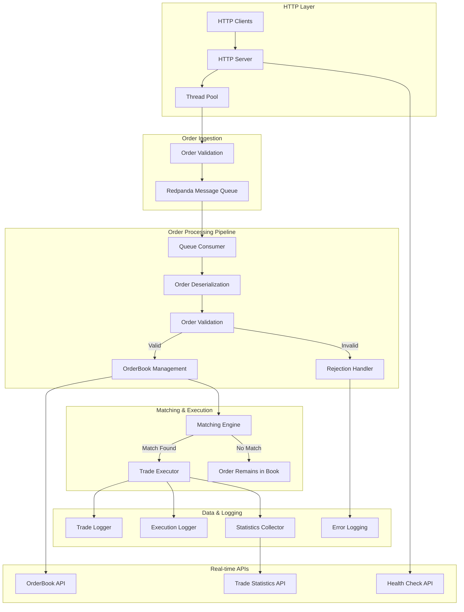

# Live Trading Engine

[](https://github.com/ACquantclub/live-trading-engine/actions/workflows/ci.yml)
[](https://opensource.org/licenses/MIT)

A high-performance, low-latency trading engine built in C++23 with asynchronous order processing, real-time matching, and HTTP API endpoints.

## Architecture



## Quick Start

### Prerequisites
- C++23 compatible compiler (GCC 12+ or Clang 15+)
- CMake 3.20+
- Redpanda or Kafka (for message queue)

### Build and Run
```bash
# Clone the repository
git clone https://github.com/ACquantclub/live-trading-engine.git
cd live-trading-engine

# Build the project
./scripts/build.sh

# Start the trading engine
./build/apps/trading_engine/trading_engine

# Run tests
./scripts/run_tests.sh
```

### Configuration
The engine uses `config/trading_engine.json` for configuration:

```json
{
  "http": {
    "host": "0.0.0.0",
    "port": 8080,
    "threads": 4
  },
  "redpanda": {
    "brokers": "<redpanda-host>:9092"
  },
  "statistics": {
    "enabled": true,
    "queue_capacity": 10000,
    "cleanup_interval": 3600
  },
  "admin": {
    "enabled": true,
    "password": "secure_admin_password_2025"
  }
}
```

## HTTP API Reference

The trading engine exposes several HTTP endpoints for order management and market data access.

### Base URL
```
http://<trading-engine-host>:8080
```

### Endpoints

#### Submit Order
Submit a new trading order for asynchronous processing.

**Request:**
```http
POST /order
Content-Type: application/json

{
  "id": "order_12345",
  "userId": "trader_001", 
  "symbol": "AAPL",
  "type": "LIMIT",
  "side": "BUY",
  "quantity": 100,
  "price": 150.50
}
```

**Response:**
```http
HTTP/1.1 202 Accepted
Content-Type: application/json

{
  "status": "order accepted for processing",
  "order_id": "order_12345"
}
```

**Order Types:**
- `LIMIT` - Execute at specified price or better
- `MARKET` - Execute immediately at best available price  
- `STOP` - Trigger order when price reaches stop level

**Order Sides:**
- `BUY` - Purchase order
- `SELL` - Sale order

#### Get OrderBook
Retrieve the current state of the order book for a symbol.

**Request:**
```http
GET /api/v1/orderbook/{symbol}
```

**Example:**
```http
GET /api/v1/orderbook/AAPL
```

**Response:**
```http
HTTP/1.1 200 OK
Content-Type: application/json

{
  "symbol": "AAPL",
  "bids": [
    {"price": 150.50, "quantity": 100},
    {"price": 150.45, "quantity": 250}
  ],
  "asks": [
    {"price": 150.55, "quantity": 150},
    {"price": 150.60, "quantity": 200}
  ],
  "best_bid": 150.50,
  "best_ask": 150.55,
  "spread": 0.05
}
```

#### Get Trading Statistics
Retrieve trading statistics for a symbol across different timeframes.

**Request:**
```http
GET /api/v1/stats/{symbol}
```

**Example:**
```http
GET /api/v1/stats/AAPL
```

**Response:**
```http
HTTP/1.1 200 OK
Content-Type: application/json

{
  "symbol": "AAPL",
  "timestamp": 1692633600,
  "data": {
    "last_trade_price": 150.75,
    "timeframes": {
      "1m": {
        "open": 150.50,
        "high": 151.00,
        "low": 150.25,
        "close": 150.75,
        "volume": 1500.0,
        "dollar_volume": 225750.0,
        "trade_count": 12,
        "vwap": 150.50,
        "timestamp": 1692633600
      },
      "1h": {
        "open": 149.80,
        "high": 151.20,
        "low": 149.50,
        "close": 150.75,
        "volume": 45000.0,
        "dollar_volume": 6768750.0,
        "trade_count": 248,
        "vwap": 150.42,
        "timestamp": 1692633600
      },
      "1d": {
        "open": 148.90,
        "high": 151.50,
        "low": 148.75,
        "close": 150.75,
        "volume": 180000.0,
        "dollar_volume": 27135000.0,
        "trade_count": 892,
        "vwap": 150.75,
        "timestamp": 1692633600
      }
    }
  }
}
```

#### Get Statistics for Specific Timeframe
Retrieve trading statistics for a symbol and specific timeframe.

**Request:**
```http
GET /api/v1/stats/{symbol}/{timeframe}
```

**Example:**
```http
GET /api/v1/stats/AAPL/1m
```

**Response:**
```http
HTTP/1.1 200 OK
Content-Type: application/json

{
  "symbol": "AAPL",
  "timeframe": "1m",
  "timestamp": 1692633600,
  "data": {
    "open": 150.50,
    "high": 151.00,
    "low": 150.25,
    "close": 150.75,
    "volume": 1500.0,
    "dollar_volume": 225750.0,
    "trade_count": 12,
    "vwap": 150.50,
    "timestamp": 1692633600
  },
  "last_trade_price": 150.75
}
```

**Supported Timeframes:**
- `1m` - 1 minute buckets
- `1h` - 1 hour buckets  
- `1d` - 1 day buckets

#### Get All Statistics
Retrieve trading statistics for all symbols.

**Request:**
```http
GET /api/v1/stats/all
```

**Response:**
```http
HTTP/1.1 200 OK
Content-Type: application/json

{
  "timestamp": 1692633600,
  "total_symbols": 3,
  "symbols": {
    "AAPL": {
      "last_trade_price": 150.75,
      "timeframes": {
        "1m": { "open": 150.50, "high": 151.00, "low": 150.25, "close": 150.75, "volume": 1500.0, "dollar_volume": 225750.0, "trade_count": 12, "vwap": 150.50, "timestamp": 1692633600 },
        "1h": { "open": 149.80, "high": 151.20, "low": 149.50, "close": 150.75, "volume": 45000.0, "dollar_volume": 6768750.0, "trade_count": 248, "vwap": 150.42, "timestamp": 1692633600 },
        "1d": { "open": 148.90, "high": 151.50, "low": 148.75, "close": 150.75, "volume": 180000.0, "dollar_volume": 27135000.0, "trade_count": 892, "vwap": 150.75, "timestamp": 1692633600 }
      }
    },
    "MSFT": {
      "last_trade_price": 335.20,
      "timeframes": { "..." }
    }
  }
}
```

#### Get Statistics Summary
Retrieve market-wide statistics summary and system metrics.

**Request:**
```http
GET /api/v1/stats/summary
```

**Response:**
```http
HTTP/1.1 200 OK
Content-Type: application/json

{
  "timestamp": 1692633600,
  "total_symbols": 150,
  "total_trades_processed": 45892,
  "total_trades_dropped": 12,
  "queue_size": 0,
  "market_summary": {
    "total_volume": 2450000.0,
    "total_dollar_volume": 367500000.0,
    "total_trades": 15420,
    "price_range": {
      "min": 25.50,
      "max": 1850.75
    }
  }
}
```

#### Get Leaderboard
Retrieve a live leaderboard ranking users by net worth (cash + portfolio value at current market prices).

**Request:**
```http
GET /api/v1/leaderboard
```

**Response:**
```http
HTTP/1.1 200 OK
Content-Type: application/json

{
  "timestamp": 1692633600,
  "total_users": 50,
  "leaderboard": [
    {
      "rank": 1,
      "user_id": "trader_001",
      "net_worth": 125750.50,
      "cash_balance": 25000.00,
      "portfolio_value": 100750.50,
      "realized_pnl": 5750.50,
      "positions": [
        {
          "symbol": "AAPL",
          "quantity": 500.0,
          "average_price": 145.20,
          "current_price": 150.75,
          "market_value": 75375.00,
          "unrealized_pnl": 2775.00
        },
        {
          "symbol": "MSFT",
          "quantity": 75.0,
          "average_price": 330.00,
          "current_price": 335.50,
          "market_value": 25162.50,
          "unrealized_pnl": 412.50
        }
      ]
    },
    {
      "rank": 2,
      "user_id": "trader_002",
      "net_worth": 98250.25,
      "cash_balance": 15000.00,
      "portfolio_value": 83250.25,
      "realized_pnl": -1749.75,
      "positions": [
        {
          "symbol": "GOOGL",
          "quantity": 50.0,
          "average_price": 2850.00,
          "current_price": 2875.25,
          "market_value": 143762.50,
          "unrealized_pnl": 1262.50
        }
      ]
    }
  ]
}
```

**Response Fields:**
- `rank` - User's position on the leaderboard (1 = highest net worth)
- `net_worth` - Total value (cash + portfolio at current market prices)
- `cash_balance` - Available cash balance
- `portfolio_value` - Total value of all positions at current market prices
- `realized_pnl` - Cumulative realized profit/loss from closed positions
- `positions` - Array of current holdings with market valuations
  - `current_price` - Current market price (mid-price from order book, or cost basis if no market data)
  - `market_value` - Position value at current market price
  - `unrealized_pnl` - Paper profit/loss relative to average purchase price

#### Health Check
Check the health and status of the trading engine.

**Request:**
```http
GET /health
```

**Response:**
```http
HTTP/1.1 200 OK
Content-Type: application/json

{
  "status": "healthy",
  "running": true
}
```

### Admin Endpoints

The trading engine provides administrative endpoints for system control and monitoring. These endpoints require authentication and are disabled by default for security.

#### Configuration
To enable admin endpoints, configure them in `config/trading_engine.json`:

```json
{
  "admin": {
    "enabled": true,
    "password": "your_secure_admin_password"
  }
}
```

#### Authentication Methods

Admin endpoints support three authentication methods:

1. **Query Parameter:** `?password=your_password`
2. **Bearer Token:** `Authorization: Bearer your_password`
3. **Custom Header:** `X-Admin-Password: your_password`

#### Admin Status
Get the current system status and trading state.

**Request:**
```http
GET /admin/status?password=your_password
```

**Response:**
```http
HTTP/1.1 200 OK
Content-Type: application/json

{
  "trading_active": true,
  "engine_running": true,
  "admin_enabled": true,
  "total_orderbooks": 5,
  "total_users": 42,
  "statistics": {
    "total_trades_processed": 15420,
    "total_trades_dropped": 5,
    "queue_size": 0
  },
  "timestamp": 1692633600
}
```

#### Stop Trading
Suspend all trading operations while allowing existing orders to be processed.

**Request:**
```http
POST /admin/stop_trading
X-Admin-Password: your_password
```

**Response:**
```http
HTTP/1.1 200 OK
Content-Type: application/json

{
  "status": "success",
  "message": "Trading suspended - existing orders will be processed",
  "trading_active": false,
  "timestamp": 1692633600
}
```

#### Resume Trading
Resume trading operations after being stopped.

**Request:**
```http
POST /admin/resume_trading
Authorization: Bearer your_password
```

**Response:**
```http
HTTP/1.1 200 OK
Content-Type: application/json

{
  "status": "success",
  "message": "Trading resumed",
  "trading_active": true,
  "timestamp": 1692633600
}
```

#### Flush System
Clear all order books and reset user portfolios. Trading must be stopped first.

**Request:**
```http
POST /admin/flush_system
Authorization: Bearer your_password
```

**Response (Success):**
```http
HTTP/1.1 200 OK
Content-Type: application/json

{
  "status": "success",
  "message": "System flushed - order books cleared, user portfolio reset limited by API",
  "cleared_orderbooks": 5,
  "noted_users": 42,
  "starting_cash": 100000.0,
  "trading_active": false,
  "note": "Complete user portfolio reset requires User class API updates",
  "timestamp": 1692633600
}
```

**Response (Trading Active Error):**
```http
HTTP/1.1 400 Bad Request
Content-Type: application/json

{
  "error": "Must stop trading before flushing system"
}
```

#### Admin Authentication Errors

**Unauthorized (Invalid/Missing Password):**
```http
HTTP/1.1 401 Unauthorized
Content-Type: application/json

{
  "error": "Unauthorized: Invalid admin credentials"
}
```

### Error Responses

The API returns standard HTTP status codes and JSON error messages:

**400 Bad Request:**
```json
{
  "error": "Invalid JSON format: Unexpected character..."
}
```

**404 Not Found:**
```json
{
  "error": "Order book not found for symbol: XYZ"
}
```

**503 Service Unavailable:**
```json
{
  "error": "Statistics collector not available"
}
```

**500 Internal Server Error:**
```json
{
  "error": "Internal server error: Connection failed"
}
```

## Usage Examples

### Python Client Example
```python
import requests
import json

# Submit a buy order
order = {
    "id": "order_001",
    "userId": "trader_123",
    "symbol": "AAPL", 
    "type": "LIMIT",
    "side": "BUY",
    "quantity": 100,
    "price": 150.25
}

response = requests.post('http://<trading-engine-host>:8080/order', json=order)
print(response.json())

# Get order book
orderbook = requests.get('http://<trading-engine-host>:8080/api/v1/orderbook/AAPL')
print(orderbook.json())

# Get trading statistics
stats = requests.get('http://<trading-engine-host>:8080/api/v1/stats/AAPL')
print(stats.json())

# Get statistics for specific timeframe
stats_1m = requests.get('http://<trading-engine-host>:8080/api/v1/stats/AAPL/1m')
print(stats_1m.json())

# Get all statistics
all_stats = requests.get('http://<trading-engine-host>:8080/api/v1/stats/all')
print(all_stats.json())

# Get market summary
summary = requests.get('http://<trading-engine-host>:8080/api/v1/stats/summary')
print(summary.json())

# Get leaderboard
leaderboard = requests.get('http://<trading-engine-host>:8080/api/v1/leaderboard')
print(leaderboard.json())

# Admin operations (requires authentication)
admin_password = "your_admin_password"

# Get admin status with query parameter
admin_status = requests.get(f'http://<trading-engine-host>:8080/admin/status?password={admin_password}')
print(admin_status.json())

# Stop trading with Bearer token
headers = {'Authorization': f'Bearer {admin_password}'}
stop_response = requests.post('http://<trading-engine-host>:8080/admin/stop_trading', headers=headers)
print(stop_response.json())

# Resume trading with custom header
headers = {'X-Admin-Password': admin_password}
resume_response = requests.post('http://<trading-engine-host>:8080/admin/resume_trading', headers=headers)
print(resume_response.json())

# Flush system (after stopping trading)
flush_response = requests.post('http://<trading-engine-host>:8080/admin/flush_system', headers=headers)
print(flush_response.json())
```

### curl Examples
```bash
# Submit order
curl -X POST http://<trading-engine-host>:8080/order \
  -H "Content-Type: application/json" \
  -d '{
    "id": "order_001",
    "userId": "trader_123", 
    "symbol": "AAPL",
    "type": "LIMIT", 
    "side": "BUY",
    "quantity": 100,
    "price": 150.25
  }'

# Get order book
curl http://<trading-engine-host>:8080/api/v1/orderbook/AAPL

# Get trading statistics
curl http://<trading-engine-host>:8080/api/v1/stats/AAPL

# Get statistics for specific timeframe
curl http://<trading-engine-host>:8080/api/v1/stats/AAPL/1m

# Get all statistics  
curl http://<trading-engine-host>:8080/api/v1/stats/all

# Get market summary
curl http://<trading-engine-host>:8080/api/v1/stats/summary

# Get leaderboard
curl http://<trading-engine-host>:8080/api/v1/leaderboard

# Health check  
curl http://<trading-engine-host>:8080/health

# Admin endpoints (requires authentication)
ADMIN_PASSWORD="your_admin_password"

# Get admin status with query parameter
curl "http://<trading-engine-host>:8080/admin/status?password=${ADMIN_PASSWORD}"

# Get admin status with Bearer token
curl -H "Authorization: Bearer ${ADMIN_PASSWORD}" \
  http://<trading-engine-host>:8080/admin/status

# Stop trading with custom header
curl -X POST -H "X-Admin-Password: ${ADMIN_PASSWORD}" \
  http://<trading-engine-host>:8080/admin/stop_trading

# Resume trading
curl -X POST -H "Authorization: Bearer ${ADMIN_PASSWORD}" \
  http://<trading-engine-host>:8080/admin/resume_trading

# Flush system (after stopping trading)
curl -X POST -H "X-Admin-Password: ${ADMIN_PASSWORD}" \
  http://<trading-engine-host>:8080/admin/flush_system
```

## Key Features

- **Asynchronous Processing:** Orders are queued via Redpanda for high-throughput processing
- **Real-time Matching:** Immediate order matching with price-time priority
- **HTTP API:** RESTful endpoints for order submission and market data
- **Admin Controls:** Secure administrative endpoints for system management and trading control
- **Query Parameter Support:** Flexible URL query parameter parsing with URL decoding
- **Thread Safety:** Concurrent order processing with thread pool management  
- **Comprehensive Logging:** Trade execution and application event logging
- **Real-time Statistics:** Live trading statistics with multiple timeframes (1m, 1h, 1d)
- **Market Analytics:** OHLCV data, VWAP calculations, and volume metrics
- **Health Monitoring:** Built-in health checks and system status endpoints

## Contributing

See [CONTRIBUTING.md](CONTRIBUTING.md) for development setup, coding standards, and contribution guidelines.

## License

This project is licensed under the MIT License - see the [LICENSE](LICENSE) file for details.
